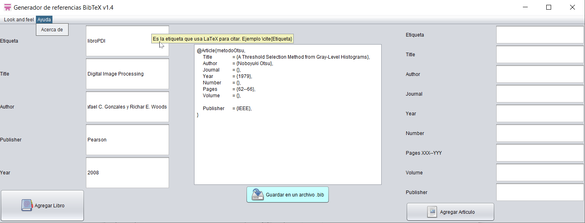
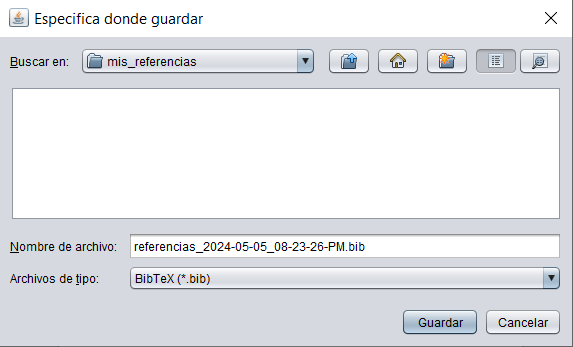
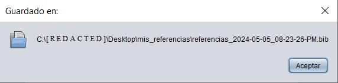
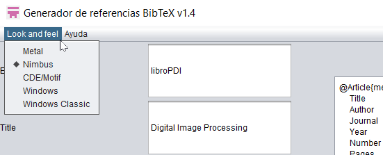
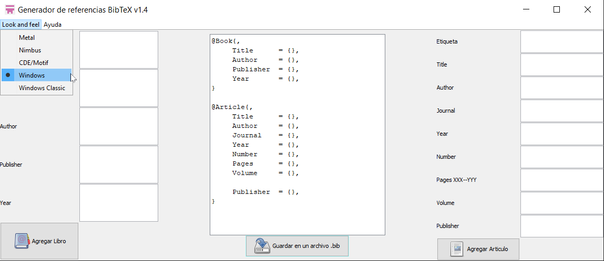
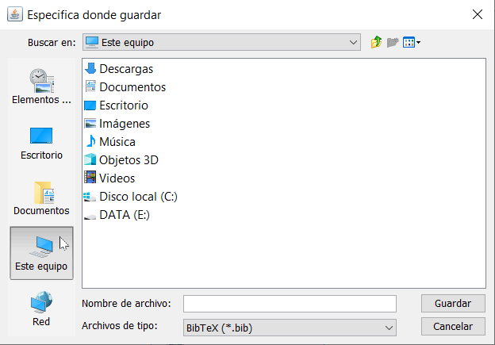
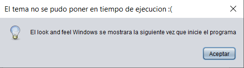

# Generador de referencias BibTeX en Java

Genera referencias de libros y artículos. 

Se pueden agregar las referencias bibliográficas **sin** llenar los campos de texto, solamente haciendo click en los botones de *Agregar Libro* o *Agregar Articulo*.

Lo anterior es útil para tener una plantilla con las referencias bibliográficas.

## Cambiar el tema de la GUI (Look and feel)

En el menú de opciones se agrega un listado con los *Look and feel* (a veces conocidos como temas, aspectos, entre otros) proporcionados por la versión de Java del usuario, con la intención de mejorar la experiencia de uso.

Un ejemplo es el Look and feel Windows:

El `jfilechooser` de Windows es el siguiente:

Por el momento el cambio de tema (look and feel) no se puede hacer en tiempo de ejecución mostrando el siguiente mensaje:

## Requerimientos

Esta hecho en Java sin ninguna librería adicional **pero** se necesita Java jdk o jre para ejecutarlo. Se pueden encontrar aqui:

https://www.oracle.com/java/technologies/downloads/#java8

https://www.java.com/es/download/manual.jsp

**Se sugiere usar jdk8 o jre8 para una mejor experiencia de uso.**

Al usar el `.jar` (un ejecutable de Java) si tienes el jdk instalado, estas en Linux y no se ejecuta, prueba cambiando los permisos de ejecución con: click derecho -> propiedades.

## Notas

- En todos los campos de texto se puede poner cualquier letra o número.

- Al guardar el archivo la información del area de texto se elimina, se debe verificar que la información sea correcta al igual que el nombre de archivo.

- Es un programa *offline*, no usa internet.

## Agradecimientos

Al proyecto Tango por los iconos. 

<a href="https://commons.wikimedia.org/wiki/Tango_icons" target="_blank">https://commons.wikimedia.org/wiki/Tango_icons</a>