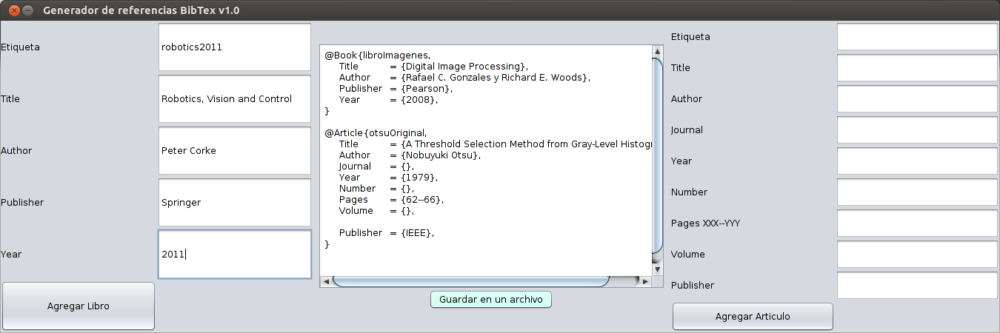

# Generador de referencias BibTeX en Java

Genera referencias de libros y artículos, además se pueden agregar las plantillas sin llenar solamente haciedo click en los botones de agregar referencia.

Esta hecho en java sin ninguna librería adicional por lo que se necesita el jdk para ejecutarlo. Si tienes el jdk instalado, estas en linux y no se ejecuta prueba cambiando los permisos de ejecución (click derecho -> propiedades).

### Notas

- En todos los campos de texto se puede poner cualquier letra o número, tal vez se cambie después

- Al guardar el archivo la información del area de texto se elimina, se debe verificar que la información sea correcta al igual que el nombre de archivo

- Usa un tema llamado *nimbus* proporcionado por java por lo que si se usa una versión vieja de java tal vez no se vea el tema

- Es un programa *offline* lo que quiere decir que no se puede agregar referencias mediante internet

- El código fuente se encuentra dentro del jar y se puede extraer con WinRAR o 7-Zip como si fuera un archivo comprimido
     
