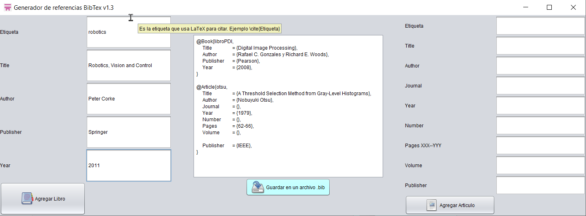
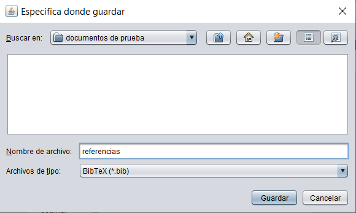
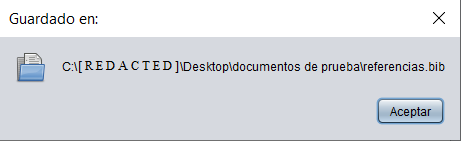

# Generador de referencias BibTeX en Java

Genera referencias de libros y artículos. 

Se pueden agregar las referencias bibliográficas sin llenar los campos de texto solamente haciendo click en los botones de *Agregar Libro* o *Agregar Articulo*.

Lo anterior es útil para tener una plantilla con las referencias bibliográficas.

Esta hecho en Java sin ninguna librería adicional por lo que se necesita el jdk para ejecutarlo. Si tienes el jdk instalado, estas en linux y no se ejecuta prueba cambiando los permisos de ejecución (click derecho -> propiedades).

## Notas

- En todos los campos de texto se puede poner cualquier letra o número.

- Al guardar el archivo la información del area de texto se elimina, se debe verificar que la información sea correcta al igual que el nombre de archivo.

- Usa un tema llamado *nimbus* proporcionado por java por lo que si se usa una versión vieja de java tal vez no se vea el tema.

- Es un programa *offline*, no usa internet.

## Agradecimientos

Al proyecto Tango por los iconos. 

<a href="https://commons.wikimedia.org/wiki/Tango_icons" target="_blank">https://commons.wikimedia.org/wiki/Tango_icons</a>